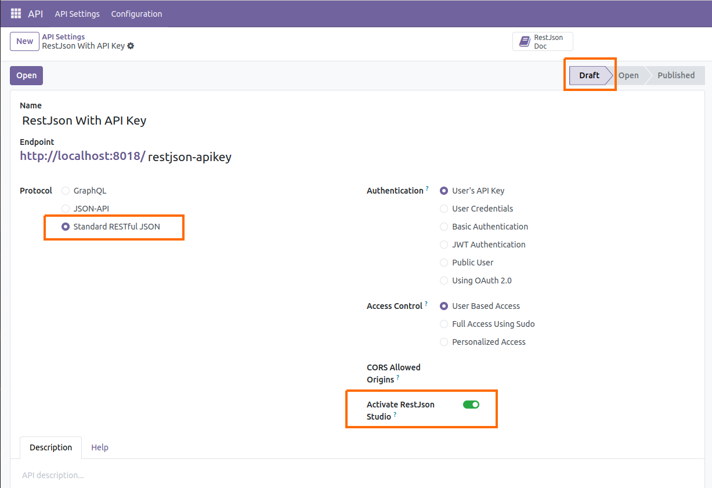
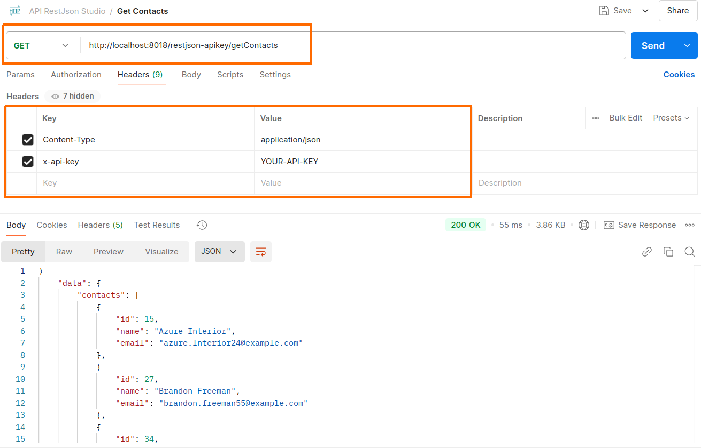
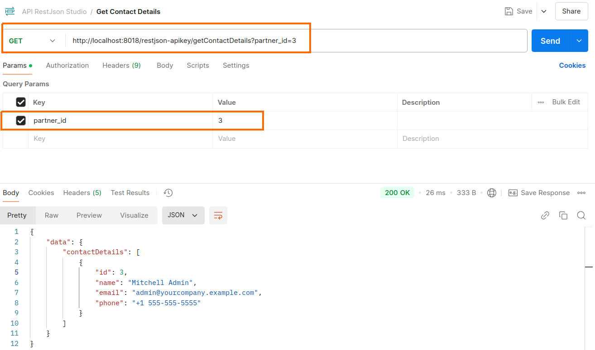
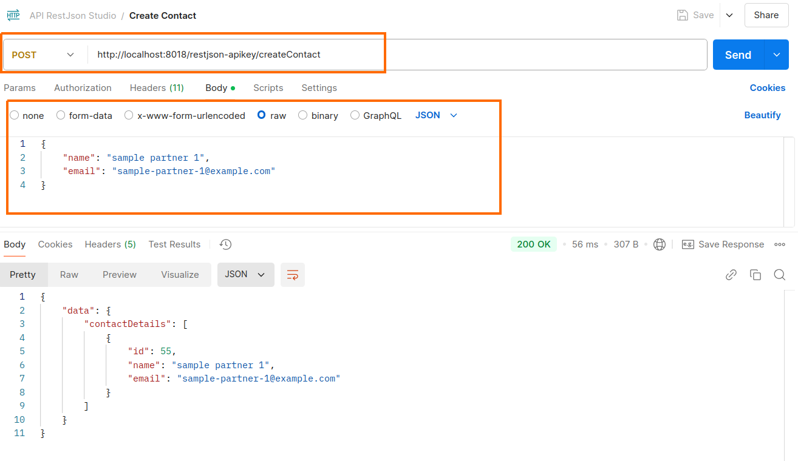
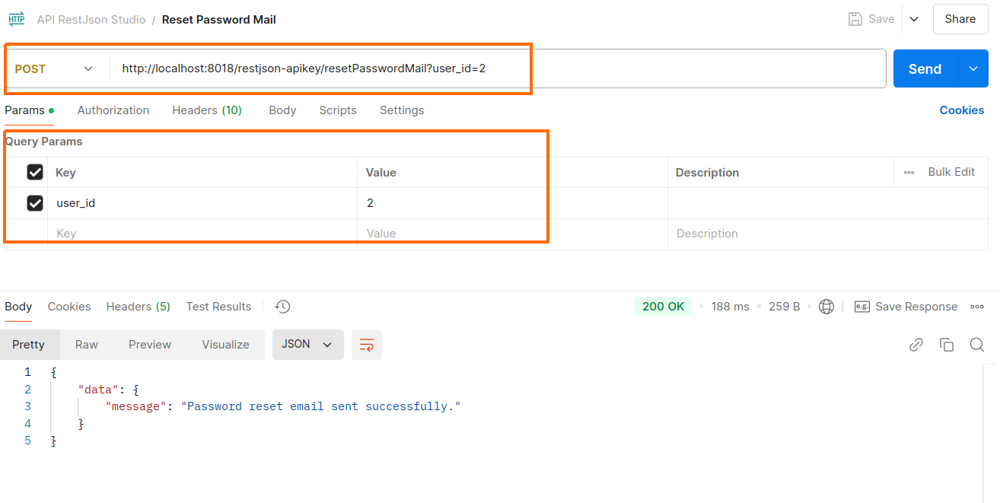
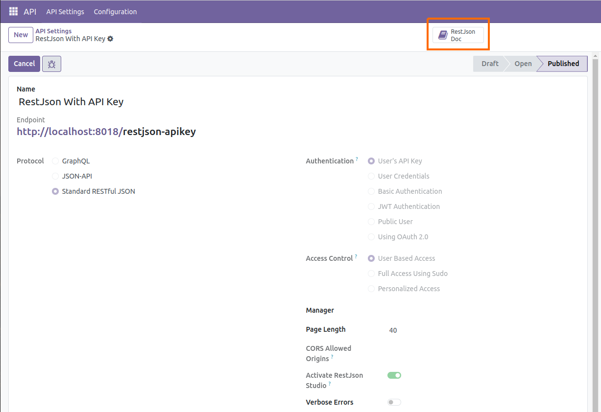
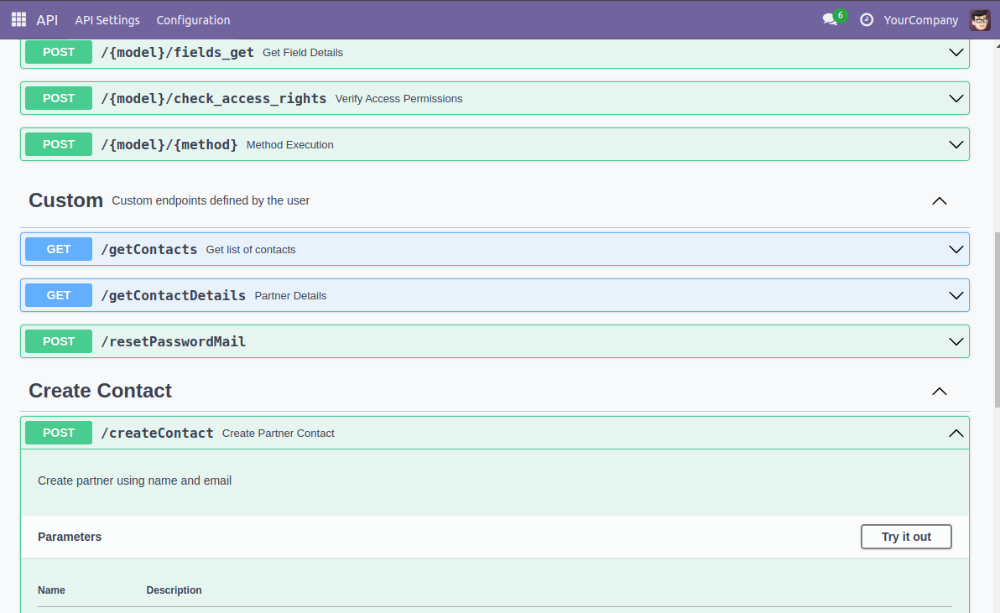

# RestJson Studio

## Introduction

This module allows you to write your own Custom API Endpoints using Rest Json with Swagger documentation. Here you can use various features of api_framework like different authentication, CORS configurations etc.

## Configuring API




## How It Works

 ### Create Endpoint

 - To create a custom API endpoint, define methods within the **easy.restjson.customstudio** model. You can find the relevant file at: */models/custom_restjson_studio.py*.

 - Use the **def my_custom_restjson(cls)** method to define your endpoint. Ensure the method returns a dictionary of endpoints, you can refere example at: */models/custom_restjson_studio.py*.

 - Define a method matching one of the names in the key of the dictionary above. Ensure it accepts *params* as a parameter.

 - The methods you implement must return a dictionary object or Response.

 - Access your defined custom endpoints using the following format: *{your-web-domain[:port]}/{your-api-endpoint}/{your-custom-endpoint}*.

  ### Create your own documentation

  - **Note: Default documentation generated automatically for your custom endpoints.**

  - To do this, create a method in the **easy.restjson.customstudio model** You can find the relevant file at: */models/custom_restjson_studio.py*, naming it starting with *"\_doc\_"* followed by "yourCustomEndpointMethod", such as *"\_doc\_{yourCustomEndpointMethod}"*. This method should return a dictionary in the Swagger format, including keys like *"tags, summary, description, parameters, responses, etc."*. You can find an example in */models/custom_restjson_studio.py*.

## For more detail please refer below examples

```python
import json
from werkzeug.datastructures import Headers
from odoo import models
from odoo.http import request, Response


class MyRestJsonCustomStudio(models.AbstractModel):
    _inherit = 'easy.restjson.customstudio'

    @classmethod
    def my_custom_restjson(cls):
        res = super().my_custom_restjson()
        res.update(
            {
                'getContacts': {'method': 'GET'},
                'getContactDetails': {'method': 'GET'},
                'createContact': {'method': 'POST'},
                'resetPasswordMail': {'method': 'POST'},
            }
          )
        return res

    @classmethod
    def getContacts(cls, params) -> dict:
        """Get list of contacts
        return list of contacts with name, email fields.
        """
        try:
            partners = request.env['res.partner'].search_read([], fields=['name', 'email'])
            result = {'data': {'contacts': partners}}
        except Exception as exc:
            result = {'errors': exc.args}
        return result

    @classmethod
    def getContactDetails(cls, params) -> dict:
        try:
            partner = request.env['res.partner'].browse(int(params['partner_id']))
            result = {'data': {'contactDetails': partner.read(fields=['name', 'email', 'phone'])}}
            data = json.dumps(result, ensure_ascii=False)
            headers = Headers()
            headers['Content-Length'] = len(data)
            headers['Content-Type'] = 'application/json; charset=utf-8'
            return Response(data, headers=headers ,status=200)
        except Exception as exc:
            result = {'errors': exc.args}
        return result

    @classmethod
    def createContact(cls, params) -> dict:
        try:
            partner = request.env['res.partner'].create({'name': params['name'], 'email': params['email']})
            result = {'data': {'contactDetails': partner.read(fields=['name', 'email'])}}
        except Exception as exc:
            result = {'errors': exc.args}
        return result

    @classmethod
    def _doc_createContact(cls) -> dict:
        return {
            'tags': ['Create Contact'],
            'summary': 'Create Partner Contact',
            'description': 'Create partner using name and email',
            'parameters': [
              {
                "in": "body",
                "name": "create-contact",
                "description": "Create Contact Body",
                "required": True,
                "schema": {
                  "type": "object",
                    "properties": {
                      "name": {
                        "type": "string"
                      },
                      "email": {
                        "type": "string"
                      },
                    },
                }
              }
            ],
            'responses': cls._swagger_default_responses()
        }

    @classmethod
    def resetPasswordMail(cls, params) -> dict:
        try:
            user = request.env['res.users'].browse(int(params['user_id']))
            user.action_reset_password()
            result = {'data': {'message': 'Password reset email sent successfully.'}}
        except Exception as exc:
            result = {'errors': {'message': 'Failed to send the password reset email.'}}
        return result
```

### Request Considering above Examples

**Get Contacts**



```python
import requests
import json

url = "http://localhost:8018/restjson-apikey/getContacts"

payload = {}
headers = {
  'Content-Type': 'application/json',
  'x-api-key': 'YOUR-API-KEY'
}

response = requests.request("GET", url, headers=headers, data=payload)

print(response.text)
```

**Get Contact Details**



```python
import requests
import json

url = "http://localhost:8018/restjson-apikey/getContactDetails?partner_id=3"

payload = {}
headers = {
  'Content-Type': 'application/json',
  'x-api-key': 'YOUR-API-KEY'
}

response = requests.request("GET", url, headers=headers, data=payload)

print(response.text)
```

**Create Contact**



```python
import requests
import json

url = "http://localhost:8018/restjson-apikey/createContact"

payload = json.dumps({
  "name": "sample partner 1",
  "email": "sample-partner-1@example.com"
})
headers = {
  'Content-Type': 'application/json',
  'x-api-key': 'YOUR-API-KEY'
}

response = requests.request("POST", url, headers=headers, data=payload)

print(response.text)
```

**Reset Password Mail**



```python
import requests
import json

url = "http://localhost:8018/restjson-apikey/resetPasswordMail?user_id=2"

payload = {}
headers = {
  'Content-Type': 'application/json',
  'x-api-key': 'YOUR-API-KEY'
}

response = requests.request("POST", url, headers=headers, data=payload)

print(response.text)
```

### Swagger Documentation




